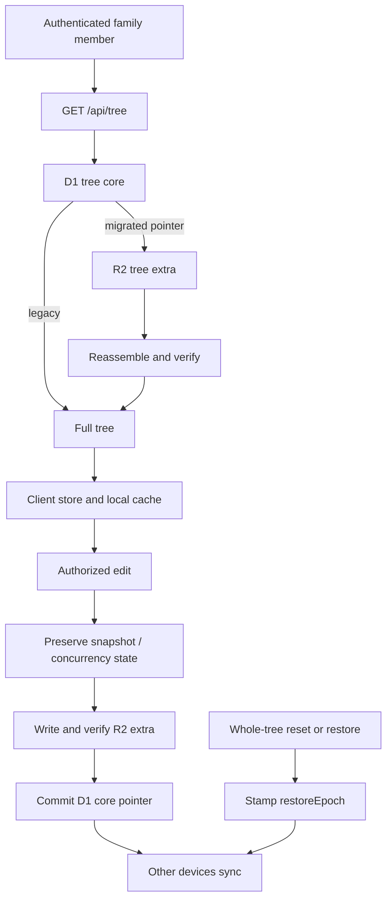

# Family data lifecycle

## Load-bearing rules

1. A migrated tree is never returned partially when required R2 extra cannot
   be read.
2. R2 extra is written and verified before D1 receives its authoritative
   pointer.
3. Whole-tree reset and recovery paths stamp `_restoreEpoch`; clients compare
   it before ordinary record-by-record merging.
4. Destructive production operations follow `docs/SAFETY.md` and require a
   separately approved R3 runbook.

