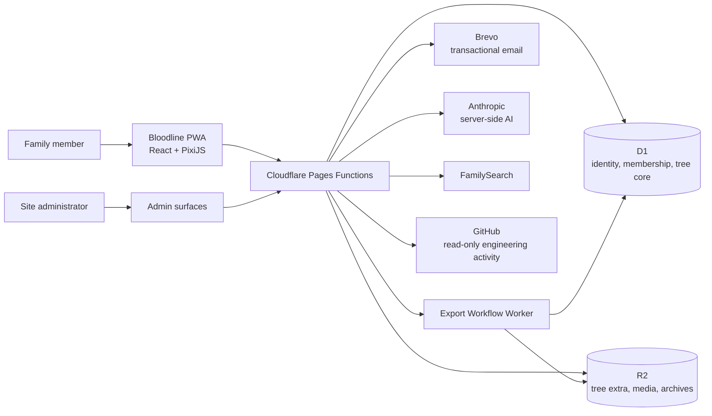

# System context

## Boundaries

- The browser never receives provider secrets.
- Pages Functions are the authoritative authentication and authorization
  boundary.
- D1 holds identity, membership, relational metadata, and the authoritative
  tree-core pointer.
- R2 holds rich tree extra, media, documents, and generated archives.
- The product activity feed reads a small projection of public repository
  metadata. It never reads pull-request bodies, patches, or family data.

